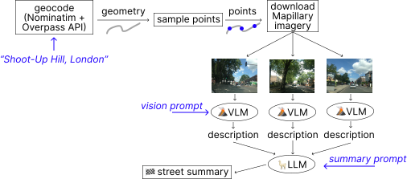

# StreetVibes 🏙️

StreetVibes is a CLI tool that automatically analyses the 'vibe' of any street using AI. It combines OpenStreetMap data, Mapillary imagery, and local Large Language Models (LLMs) to generate urban planning summaries.

Just type the street name + city, and (if there are Mapillary images), get the summary!



## 🛠️ Prerequisites

Before installing, make sure you have the following:

1. [Ollama](https://ollama.com/), installed and running (`ollama serve`)
1. AI models: pull the required models:
```bash
ollama pull llava
ollama pull llama3.1
```
3. Mapillary client token: You need a free developer token to use [Mapillary API](https://www.mapillary.com/developer/api-documentation/).

## 📦 Installation (dev)

Clone the repository and perform an _editable_ install. This allows you to modify the code and see changes instantly without reinstalling.

```bash
git clone https://github.com/ilyankou/streetvibes.git
cd streetvibes

# Install in editable mode
pip install -e .
```

## 🚀 Usage

First, set your Mapillary token as an environment variable (e.g., for Macs, add to your `~/.zshrc`):

```bash
export MAPILLARY_TOKEN="your_token_here"
```

Then, run the tool with a location query:

```zsh
$ streetvibes "Shoot-up Hill, London"
```

You can also import

### Advanced Options

You can customise the image sampling density, image output directory, and models used:

```bash
streetvibes "shoot-up hill, london" \
    --points 5 \
    --per-point 1 \
    --dir street_images \
    --v-model llava \
    --v-prompt "You are an elderly woman with mobility issues. Focus on sidewalks, crossings, and safety." \
    --t-model llama3.1 \
    --no-structured
```

**Flags:**

- `--points`: Number of locations to sample along the street (default: 5)
- `--per-point`: Number of images to download per location (default: 1)
- `--dir`: Folder to save downloaded images (default: *street_images*)
- `--v-model`: Vision model for image analysis (default: [`llava`](https://ollama.com/library/llava))
- `--v-prompt`: Override the vision prompt for persona-based analysis (default: built-in urban planner prompt)
- `--t-model`: Text model for summary synthesis (default: [`llama3.1`](https://ollama.com/library/llama3.1))
- `--structured/--no-structured`: Toggle structured JSON output (default: `--structured`)

## License

[MIT](https://github.com/ilyankou/streetvibes?tab=MIT-1-ov-file)
